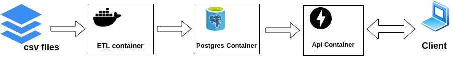
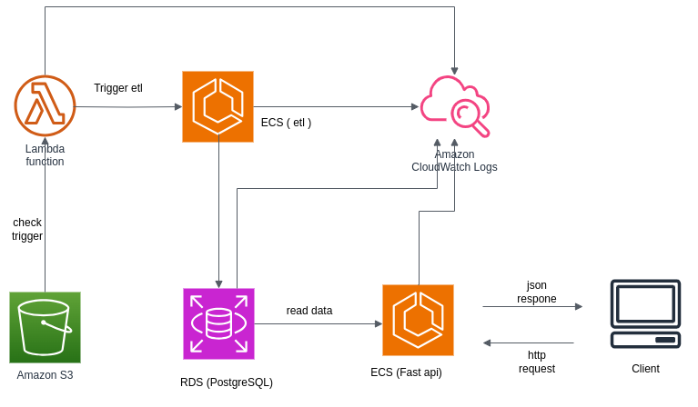

## Homte_test_DE

### Project architecture

### Prerequisites
Docker

Docker Compose

Python
### Setup
#### Clone the Repository
```
git clone https://github.com/shodayme/home_test_de.git
```

```
cd home_test_de
```
#### build the docker images
```
docker compose build
```

### Usage
#### start the api and database containers
```
docker compose up postgres_db api -d
```
#### run the etl
```
docker compose run -e INPUT_PATH=./data/ data_processor
```
where ./data/ is the relative path to the data directory and data_processor is the etl servcie name

#### Acccess the web api:

The Api response should be accessible under the localhost

```
http://localhost:8000/read/first-chunk
```

### Testing
In order to run the unit tests locally, please perform the following steps under the project root directory:
1. setup the testing venv

```
python -m venv test_venv
```

```
source test_venv/bin/activate
```

```
pip install -r test_requirements.txt
```

3. run the following command:

```
pytest -v
```
### Cloud deployment architecture

